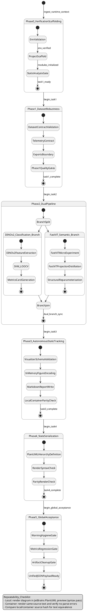

```plantuml
@startuml
hide empty description

' Label constants and transition glossary
' PHASE0_LABEL = "Phase0_VerificationScaffolding"
' PHASE1_LABEL = "Phase1_DatasetRobustness"
' PHASE2_LABEL = "Phase2_DualPipeline"
' PHASE3_LABEL = "Phase3_AutonomousStaticTracking"
' PHASE4_LABEL = "Phase4_StateSerialization"
' PHASE5_LABEL = "Phase5_GlobalAcceptance"
' ENDSTATE_LABEL = "UnifiedJSONPayloadReady"

[*] --> Phase0_VerificationScaffolding : ingest_runtime_context
state Phase0_VerificationScaffolding {
  [*] --> EnvValidation
  EnvValidation --> ProjectScaffold : env_verified
  ProjectScaffold --> StaticAnalysisGate : modules_initialized
  StaticAnalysisGate --> [*] : task1_ready
}

Phase0_VerificationScaffolding --> Phase1_DatasetRobustness : begin_task1
state Phase1_DatasetRobustness {
  [*] --> DatasetContractValidation
  DatasetContractValidation --> TelemetryContract
  TelemetryContract --> ExportsBoundary
  ExportsBoundary --> Phase1QualityGates
  Phase1QualityGates --> [*] : task1_complete
}

Phase1_DatasetRobustness --> Phase2_DualPipeline : begin_task2
state Phase2_DualPipeline {
  [*] --> BranchSplit
  state BranchSplit
  BranchSplit --> DINOv2_Classification_Branch
  BranchSplit --> FastViT_Semantic_Branch

  state DINOv2_Classification_Branch {
    [*] --> DINOv2FeatureExtraction
    DINOv2FeatureExtraction --> SVM_LOOCV
    SVM_LOOCV --> MetricsCardGeneration
    MetricsCardGeneration --> [*]
  }

  state FastViT_Semantic_Branch {
    [*] --> FastViTMicroExperiment
    FastViTMicroExperiment --> FastViTProjectionDistillation
    FastViTProjectionDistillation --> StructuralReparameterization
    StructuralReparameterization --> [*]
  }

  state BranchJoin
  DINOv2_Classification_Branch --> BranchJoin
  FastViT_Semantic_Branch --> BranchJoin
  BranchJoin --> [*] : dual_branch_sync
}

Phase2_DualPipeline --> Phase3_AutonomousStaticTracking : begin_task3
state Phase3_AutonomousStaticTracking {
  [*] --> VisualizerSchemaValidation
  VisualizerSchemaValidation --> InMemoryFigureEncoding
  InMemoryFigureEncoding --> MarkdownReportWrite
  MarkdownReportWrite --> LocalContainerParityCheck
  LocalContainerParityCheck --> [*] : task3_complete
}

Phase3_AutonomousStaticTracking --> Phase4_StateSerialization : begin_task4
state Phase4_StateSerialization {
  [*] --> PlantUMLHierarchyDefinition
  PlantUMLHierarchyDefinition --> RenderSyntaxCheck
  RenderSyntaxCheck --> ParityRenderCheck
  ParityRenderCheck --> [*] : task4_complete
}

Phase4_StateSerialization --> Phase5_GlobalAcceptance : begin_global_acceptance
state Phase5_GlobalAcceptance {
  [*] --> WarningHygieneGate
  WarningHygieneGate --> MetricsRegressionGate
  MetricsRegressionGate --> ArtifactCleanupGate
  ArtifactCleanupGate --> UnifiedJSONPayloadReady
  UnifiedJSONPayloadReady --> [*]
}

' Repeatability checklist (local + container)
legend right
  Repeatability_Checklist
  - Local: render diagram in JetBrains PlantUML preview (syntax pass)
  - Container: render same source text and verify no parse errors
  - Compare local/container source hash for text equivalence
endlegend

@enduml
```